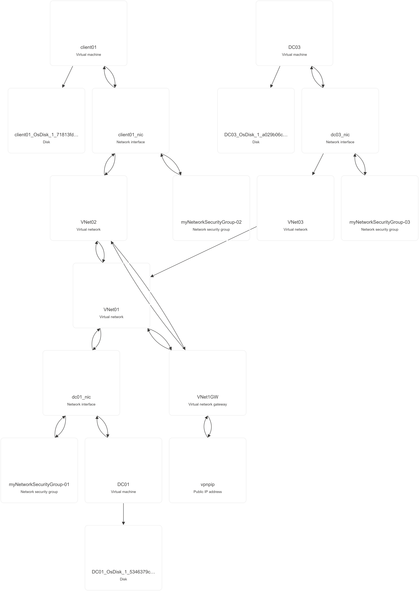

# Finalità progetto

## Definire un'infrastruttura di rete che abbia queste caratteristiche:
- 3 virtual net in regioni seperate
- 2 subnet per la Vnet-1: 
  - Per ospitare la VM-1 (Subnet-1)
  - Per il servizio di Gateway VPN (GatewaySubnet)
- 1 subnet per la Vnet-2:
  - Per ospitare la VM-2
- 1 subnet per la Vnet-3:
  - Per ospitare la VM-3
- Il peering tra le 3 reti per consentire la comunicazione birezionale

- Un ip pubblico per accedere alla rete Vnet-1: una volta dentro accedere alle VM solo attraverso gli ip privati

## Macchine virtuali coinvolte:

### VM-1
  - Macchina Windows server con controller di dominio **dom.it**. Script da realizzare con il custom script extension **ADDS.ps1**
  - Ip statico "10.10.0.4", subnet "10.10.0.0/24"

### VM-2
  - Macchine Windows Client con il dominio associato a quello del server. Script da realizzare con il custom script extension **JOINDOM_PARAM.ps1**
  - Ip dinamico, subnet "10.20.0.0/24"

### VM-3
  - Macchina Windows Server con controller di dominio **dom2.it**. Script sempre da realizzare con il custom script extension **ADDS.ps1** (riparametrizzato opportunamente)
-  Ip statico "10.30.0.4", subnet "10.30.0.0/24"
-  

---
## Topologia logica

