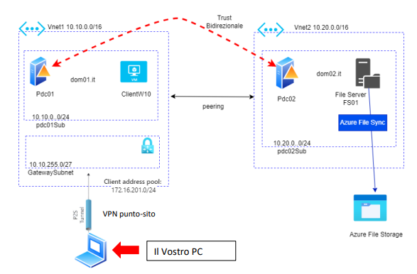
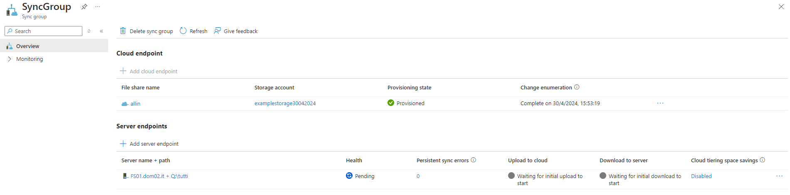
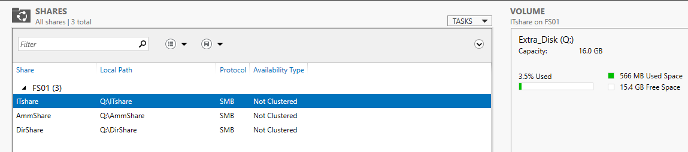
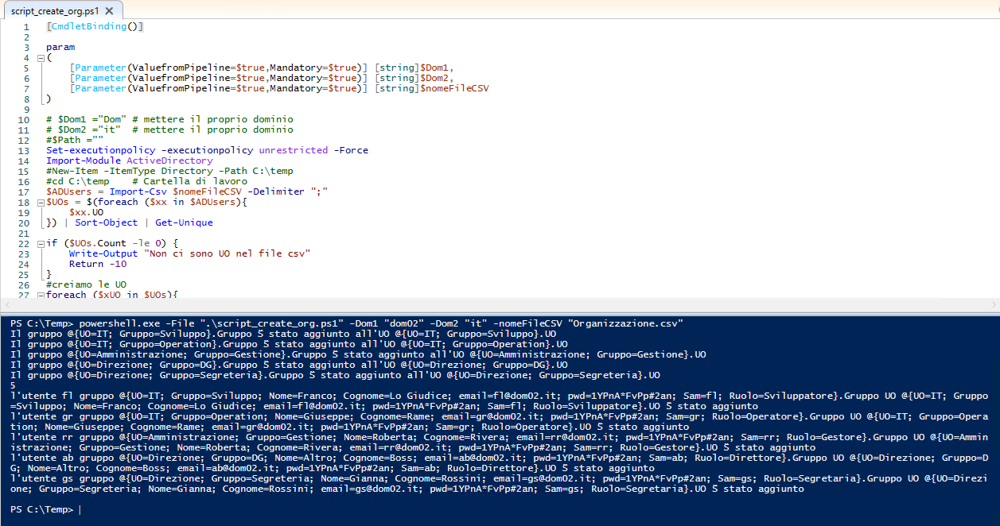
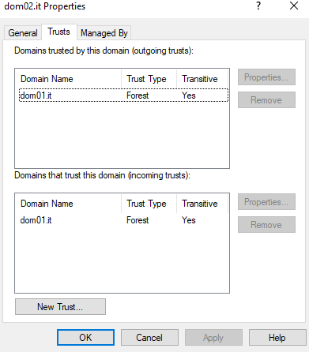

# Creazione di un ambiente per dimostrare le potenzialità di Azure 

## Descrizione Progetto
**Creare una topologia sulla falsariga di questa**

L'infrastruttura hardware e di rete verrà generata in maniera automatizzata attraverso uno script in **Terraform**

 [Per ulteriori approfondimenti su Terraform consultare la documentazione](https://registry.terraform.io/providers/hashicorp/azurerm/latest/docs)

<!-- add a page interrupt -->

Lo script ha una struttura a moduli e presenta queste caratterische:
- **main.tf root** --> definisce il gruppo di risorse, la regione, nonché il recupero della password dal segreto del keyvault. Inoltre, crea i collegamenti tra i vari moduli
- **main.tf rete** --> creazione dell'infrastruttura di rete. Al suo interno viene configurato:
  - **VNet01** 10.10.0.0/16: prima rete virtuale (localizzata in West US) con 2 subnet: 
    - **Subnet-1** 10.10.0.0/24: per ospitare le VM
    - **GatewaySubnet** 10.10.255.0/27: propedeutica alla configurazione del Gateway VPN
  - **VNet02** 10.20.0.0/16: seconda rete virtuale (localizzata in East US), stavolta con una sola sottorete:
    - **Subnet-2** 10.20.0.0/24: per ospitare le VM
  - Creazione di un IP pubblico e configurazione per l'accesso a una VPN point-to-site. Il pool di indirizzi stabilito è 172.16.201.0/24 (sarà possibile accedere alle VM solo attraverso l'ip privato)
- **main.tf peering** --> configurazione del peering delle varie reti di modo da consentirne la comunicazione
- **main.tf vm** --> configurazione di tutte le macchine virtuali, rispettivamente:
  - VNet01
    - **Pdc01**: macchina Windows Server 2022 che farà da Domain Controller per il dominio *dom01.it*, opportunatamente installato attraverso il Custom Script Extension. Il server ha un ip statico "10.10.0.6"
    - **ClientW10**: macchina Windows 10 che farà parte del dominio di Pdc01 (sempre configurato attraverso script ps1). Il client presenta un ip dinamico
  - VNet02:
    - **Pdc02**: macchina Windows Server 2022 che farà da Domain Controller per il dominio *dom02.it*, opportunatamente installato attraverso il Custom Script Extension. Il server ha un ip statico "10.20.0.6"
    - **FS01**: macchina Windows Server 2022 che farà parte del dominio di Pdc02 (sempre configurato attraverso script ps1). E' configurato con il ruolo di File Server per la condivisione di risorse. 
 In questo caso si è resa necessaria l'implementazione di un disco aggiuntivo da 16gb oltre a quello standard

<!-- add a page interrupt -->

## Struttura grafica
- **root**
  - main.tf
  - variables.tf
  - outputs.tf
  - **modules**
    - **rete**
      - main.tf
      - variables.tf
      - outputs.tf
    - **peering**
      - main.tf
      - variables.tf
    - **vm**
      - main.tf
      - variables.tf
      - outputs.tf

## Ulteriori Steps da RDP/Portale

- Download del client dal portale per connettersi alla VPN
- Installazione della struttura organizzativa nei server con Domain Controller. Le informazioni vengono reperite dal file *"Organizzazione.csv"* che viene scaricato automaticamente, insieme allo script *"CreaOrganizzazioneAD.ps1"*, alla creazione della VM recuperandolo da un blob precedente configurato
- Configurazione del trust bidirezionale tra i 2 domini
- Creazione delle risorse condiviside, attraverso il disco Q, e gestione dei permessi
- Configurazione delle ulteriori policy per gli utenti come da specifiche descritte nella consegna
- Creazione di un File Sync da portale, opportunamente configurato con il Server FS01 con l'installazione dell'agent

<!-- add a page interrupt -->

## Risultato

<!-- add a page interrupt -->

### Verifica Sync

### Shared Files

### Script per l'organizzazione

<!-- add a page interrupt -->

### Verifica Trust

### Verifica VPN

